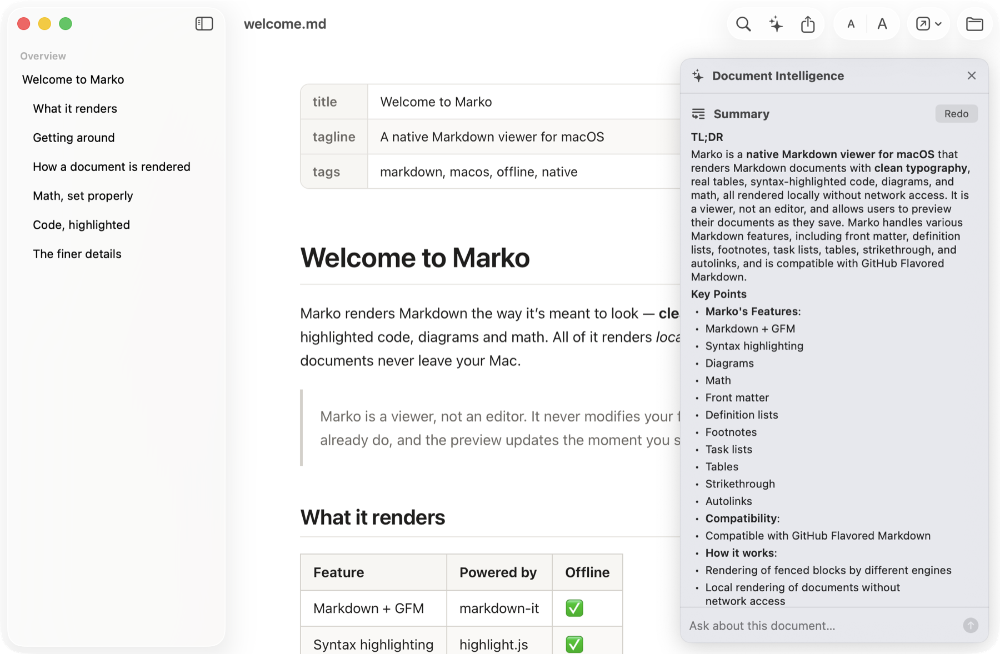

<h1 align="center">Marko</h1>

  A fast, native Markdown viewer for macOS. 
  Free, private, universal.

  
  
  

  <strong><a href="https://github.com/yash-banka/marko-releases/releases/latest/download/Marko.dmg">Download Marko for Mac</a></strong>

  

## What it does

Open a Markdown file and read it the way it was meant to look. Marko renders your
`.md` files with real typography, syntax-highlighted code, tables, diagrams, and
math. No more raw text.

- **Native.** Built in Swift and SwiftUI, with Finder-style window tabs.
- **Private.** Your documents render on your Mac and never leave it. Marko checks
  for updates and can send anonymous error reports, which you can turn off in
  Settings.
- **Viewer only.** Marko never changes your files.
- **Live reload.** Keep editing wherever you already do. The preview updates the
  moment you save.
- **Document Intelligence.** Summarize a document, ask questions about it, or
  explain a passage you select, all on device. Needs a Mac with Apple
  Intelligence.
- **Outline sidebar.** Jump to any heading.
- **Find and print.** Find in page with ⌘F. Print or export a PDF with ⌘P.
- **Info panel.** Press ⌘I for a document's path, size, and dates, its word,
  character, and heading counts, reading time, and its YAML front matter.
- **Open With.** Send the file to your editor in one click.
- **Share.** Share the Markdown source itself, so Copy puts the raw text on your
  clipboard.
- **All of GFM.** Tables and task lists, footnotes, definition lists,
  [Mermaid](https://mermaid.js.org) diagrams, and [KaTeX](https://katex.org) math.
- **Themes and zoom.** Light, Dark, and System. Text from 50% to 300%.
- **Your toolbar.** Choose which buttons to show.
- **Universal.** One app for Apple Silicon and Intel. And it's small.

  

## Document Intelligence

Summarize what you're reading. Ask a question about it. Select a passage and have
it explained. Document Intelligence does all of this on device, powered by Apple
Intelligence, so your document never leaves your Mac.

Open it with ⌥⌘I. Or select some text, right-click, and choose **Explain
Selection**.

Document Intelligence needs a Mac with Apple Intelligence. Everything else in
Marko runs on any Mac with macOS 14 or later.

  

## Install

1. [Download `Marko.dmg`](https://github.com/yash-banka/marko-releases/releases/latest/download/Marko.dmg), open it, and drag **Marko** to your **Applications** folder.
2. Open Marko from Applications. The first time, macOS won't open it and will say
   it can't verify the developer. That's expected. Marko isn't notarized by Apple
   yet. Click **Done**. *Don't click "Move to Trash".*
3. Go to **System Settings → Privacy & Security**, scroll to Security, and click
   **Open Anyway**.

You only do this once. After that, Marko opens like any other app and keeps
itself up to date.

Requires macOS 14 or later.

## Version history

See [CHANGELOG.md](CHANGELOG.md) for release notes.

## About this repository

This repo publishes the built app and the [Sparkle](https://sparkle-project.org)
update feed (`appcast.xml`) that Marko's built-in updater reads. Marko's source
code lives in a private repository.

## License

Marko is free to use.

© 2026 Yash Banka. All rights reserved. Marko's source code is not currently
open source.
