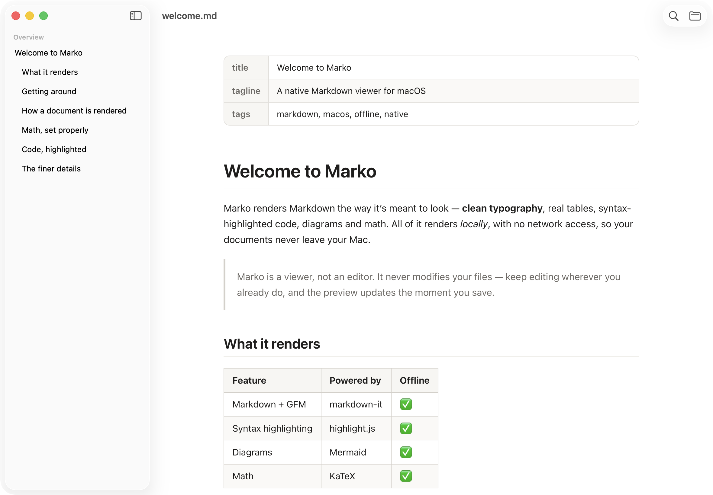
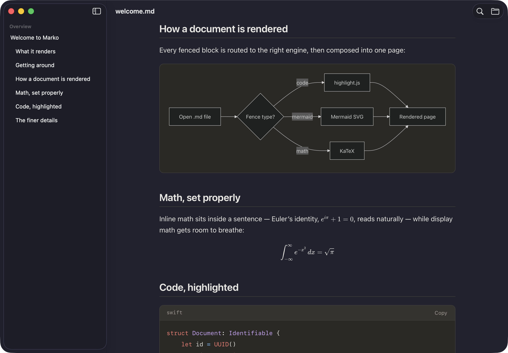

<h1 align="center">Marko</h1>

  A fast, native Markdown viewer for macOS. 
  Free, fully offline, universal.

  
  
  

  <strong><a href="https://github.com/yash-banka/marko-releases/releases/latest/download/Marko.dmg">Download Marko for Mac</a></strong>

  

## What it does

Opens `.md` files and renders them properly — clean typography, syntax-highlighted
code, tables, diagrams and math — instead of showing you raw plain text.

- **Native** — Swift and SwiftUI, with Finder-style window tabs
- **Offline** — everything renders locally; no network, ever
- **Viewer only** — Marko never modifies your files
- **Live reload** — edit in your editor, the preview updates as you save
- **Outline sidebar** — jump to any heading
- **Find in page** (⌘F) and **Print / Export PDF** (⌘P)
- **Renders** GFM tables and task lists, footnotes, definition lists, YAML front
  matter, [Mermaid](https://mermaid.js.org) diagrams and [KaTeX](https://katex.org) math
- **Light, Dark and System** themes, with adjustable text size
- **Universal** binary (Apple Silicon and Intel), about 5 MB

  

## Install

1. [Download `Marko.dmg`](https://github.com/yash-banka/marko-releases/releases/latest/download/Marko.dmg), open it, and drag **Marko** to **Applications**.
2. Open Marko from Applications. macOS will refuse to open it and say the
   developer can't be verified — Marko isn't notarized by Apple yet. Click
   **Done**. *Do not click "Move to Trash".*
3. Open **System Settings → Privacy & Security**, scroll to Security, and click
   **Open Anyway**.

You only do this once. After that Marko opens normally, and it keeps itself
updated from within the app.

Requires macOS 14 or later.

## Version history

See [CHANGELOG.md](CHANGELOG.md) for release notes.

## About this repository

This repo publishes the built app and the [Sparkle](https://sparkle-project.org)
update feed (`appcast.xml`) that Marko's built-in updater reads. Marko's source
code lives in a private repository.

## License

Marko is free to use.

© 2026 Yash Banka. All rights reserved. Marko's source code is not currently
open source.
